# SJSU CMPE195 - Senior Project
This repository contains the SJSU GO iOS app for the senior project. The app uses CocoaPods to incorporate Firebase dependencies into the project. SJSU GO is a program designed to help incentivize students to be more active in networking with other students and industry professionals. The program offers reward points when students meet certain requirements, such as attend a professional networking event or joining an engineering student organization. The app will serve as a modernized approach to help students interact with the program. The student will be able to submit proof of completed requirements for points. Students will also be able to keep track of their own points and redeem them at the end of the semester for prizes.

## Technical Requirements
* iOS Version 12.1+
* Xcode Version 11.1
* Swift Version 5

## Build Instructions
1. Download the project's ZIP file and extract the project's files
2. Open the SJSU-GO-App-master folder and click on the SJSU GO App.xcworkspace file
3. Select a physical iPhone or an iPhone simulator
4. Click the play button to build and run the app

## Overview
When the user opens the app, the user will be presented with the log in screen. If the user does not have an account, the user can click "Sign up for an account" to register. After the user successfully registers with the app, the user can enter their information in the log in screen and sign into the app.

 

Once logged in, the user will be presented with the home screen. Here the user's points are listed at the top of the screen and all of the user's submitted events are listed in the Event History table. The user can click "Give us feedback!" or "Check our FAQ!" to open their respective links in Safari. The user can click on an event to see all of the event's details that the user submitted. Clicking on the image will make it expand to the width of the screen. Clicking on the expanded image will return the image to its original size. Back on the home screen, the user can also click the "Add Event" button to submit an event.

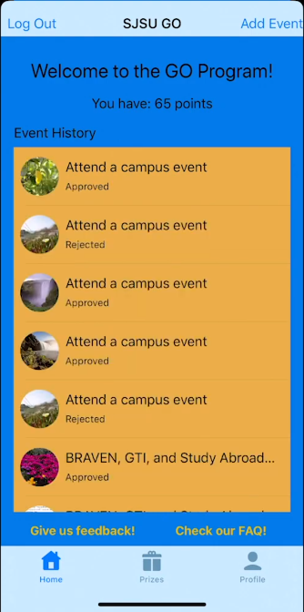 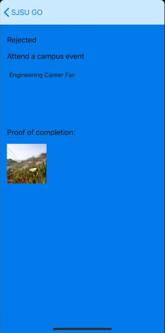 

In the event submission screen, the user can choose from a list of selected events or enter their own event type and description. The user can also choose to select an image from their phone's album or to take a picture with their phone's camera to submit as proof.

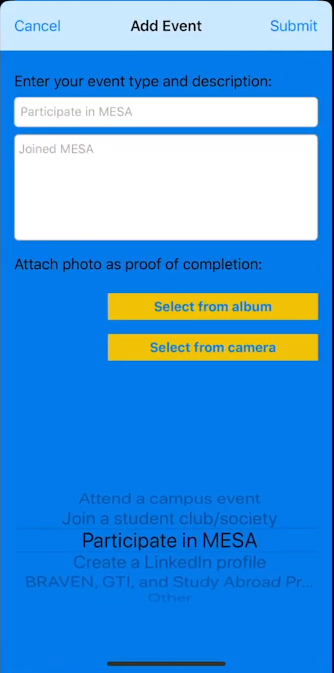 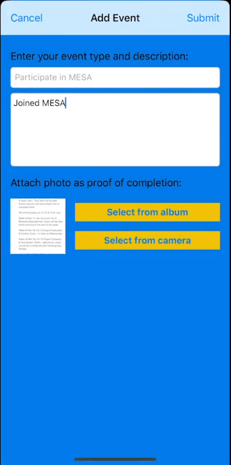 

In the Prizes tab, the user can select prizes to redeem. The user is only able to select prizes if they have enough points to do so. A confirmation screen will appear showing their current points before and after the redemption. If the user accepts, the user will see a congratulations alert with instructions on how to pick up their prizes.

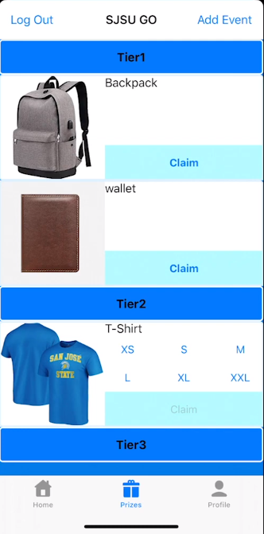 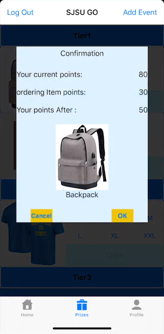 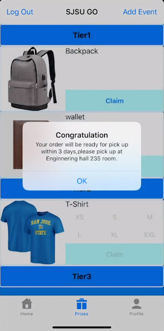 

In the Profile tab, the user can click the "Order History" button to see all the prizes they have claimed. The user is able to select a profile image by pressing on the image and update it as often as they choose by repeating the same action. In the center of the screen is the user's unique QR code. This will be combined with the QR Scanner feature, which is still in development, to facilitate the process of admins approving events. The "QR Scanner" and "Pending Events" buttons are only available to admins. Admins are currently only able to open the pending events.

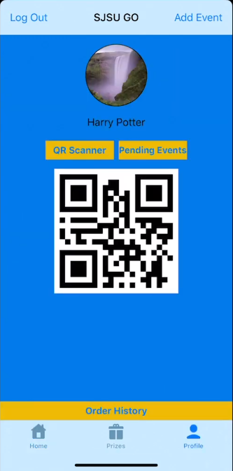 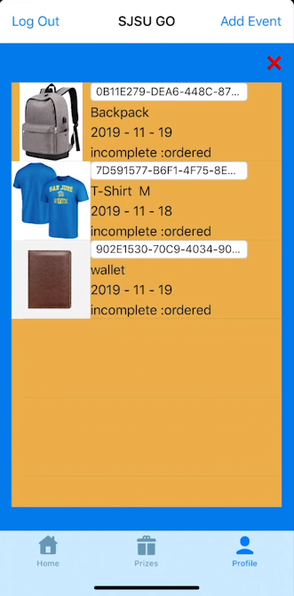

In Pending Events, the admin can see all currently pending events. Clicking on an event will present the admin with the user details and event details. The admin can reject or approve the event from this screen. Choosing one of those options will prompt the admin with a confirmation alert. If the admin chooses to approve the event, the user who submitted the event will receive points for it. If the admin chooses to reject the event, the user will not receive points for it. Once a decision has been made, the event's status is changed from "Pending" to either "Rejected" or "Approved" and removed from the Pending Events table.

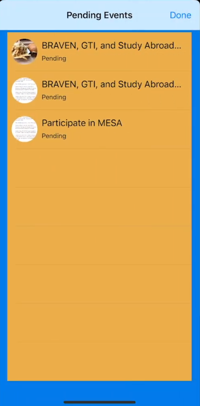 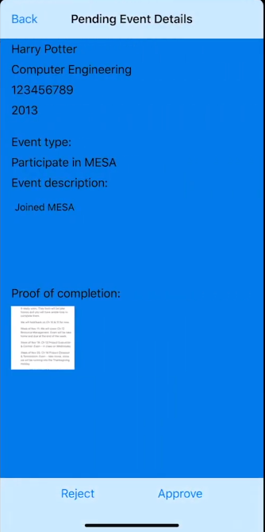 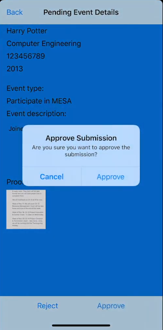
