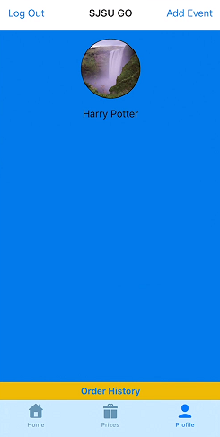

# SJSU CMPE195 - Senior Project
This repository contains the SJSU GO iOS app for the senior project. The app uses CocoaPods to incorporate Firebase dependencies into the project. This app is currently in its design stages and will be updated soon.

## Technical Requirements

## Build Instructions

## Overview
SJSU GO is a program designed to help incentivize students to be more active in networking with other students and industry professionals. The program offers reward points when students meet certain requirements, such as attend a professional networking event or joining an engineering student organization. The app will serve as a modernized approach to help students interact with the program. The student will be able to submit proof of completed requirements for points. Students will also be able to keep track of their own points and redeem them at the end of the semester.

 

  

  

   

 

  
